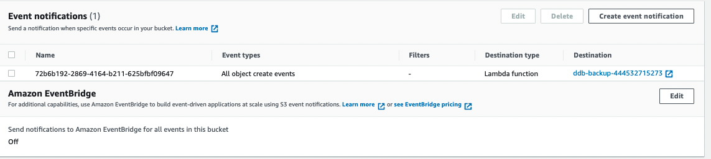

# Overview

If you already have the s3 and ddb tables provisioned

- You will have to create/set the s3 Notifications to point to/Trigger the lambda Function upon a creation event
  - s3 notification settings can be found in the Properties section
  <br>

  

<br>

- You will need to create an sns email topic for the notifcation

<br>

- You will need to edit the contents of the [lambda function](./backup.py)

  <br>

  ```python
  # environmental variables
  tableName = [enter your ddb table name here]
  snsArn = [enter your sns topic arn here]
  ```

  <br>

  - You can also edit the contents of the sns messages in the [lambda function](./backup.py)

<br>


- You will need to create a Lambda Permission for s3 to invoke that function

<br>

- You will need and IAM role for the lambda function and attach a policy with these permissions
  - "sns:Publish" (resource being the sns topic arn) 
  - "dynamodb:CreateBackup" (resource being the ddb table arn)
  - "dynamodb:DeleteBackup" and  "dynamodb:ListBackups" (resource being teh arn of the ddb table followed be `/backup/*`)

<br>

- You will also need to attach the following aws managed policies to that role
    - AWSLambdaBasicExecutionRole
    - AWSLambdaInvocation-DynamoDB

<br>
<br>
<br>

# References

### [s3 to lambda permission](https://awscli.amazonaws.com/v2/documentation/api/latest/reference/lambda/add-permission.html)

  ```
  aws lambda add-permission \
      --function-name [enter-function-name/arn-here] \
      --action lambda:InvokeFunction \
      --statement-id s3-lambda \
      --principal s3.amazonaws.com \
      --source-arn [enter-s3-buck-arn here] \
      --source-account [enter-your-account-id-here]
  ```

<hr>

### [Create a lambda function](https://awscli.amazonaws.com/v2/documentation/api/latest/reference/lambda/create-function.html)

```bash
aws lambda create-function \
    --function-name ddbBackUpFunction \
    --runtime python3.9 \
    --zip-file fileb://backup.zip \
    --handler backup.handler \
    --role [enter-arn-for-the-created-role-here] \
    --timeout 300 
    # --environment Variables={ddbTableName=enter-ddbtablename-here, snsArn=enter-sns-arn-here}

```

<hr>

### [Cli command to create a lambda notification for s3 Bucket](https://awscli.amazonaws.com/v2/documentation/api/latest/reference/s3api/put-bucket-notification-configuration.html)

  ```
  aws s3api put-bucket-notification-configuration \
      --bucket [enter-bucket-name-here] \
      --notification-configuration file://notification.json
  ```

  ```
  # contents of notifcation.json
  {
    "LambdaFunctionConfigurations": [
        {
            "LambdaFunctionArn": "enter-lanbdafunction-arn",
            "Events": [
                "s3:ObjectCreated:*"
            ]
        }
    ]
  }
  ```


<hr>

### [See the supported s3-notification types](https://docs.aws.amazon.com/AmazonS3/latest/userguide/notification-how-to-event-types-and-destinations.html#supported-notification-event-types)

<hr>

### [Create an email sns topic](https://awscli.amazonaws.com/v2/documentation/api/latest/reference/sns/index.html)

  ```
  aws sns create-topic \
      --name my-topic

  aws sns list-topics

  aws sns subscribe \
      --topic-arn arn:aws:sns:us-west-2:123456789012:my-topic \
      --protocol email \
      --notification-endpoint my-email@example.com
  ```

<hr>

### lambda policy to publish sns, backup ddb, delete ddb backups
  ```
  # policy document
  {
    "Version": "2012-10-17",
    "Statement": [
      {
        "Sid": "Stmt1651582179686",
        "Action": [
          "sns:Publish"
        ],
        "Effect": "Allow",
        "Resource": "arn:aws:sns:${Region}:${Account}:${TopicName}"
      },
      {
        "Sid": "Stmt1651582298014",
        "Action": [
          "dynamodb:CreateBackup"
        ],
        "Effect": "Allow",
        "Resource": "arn:aws:dynamodb:${Region}:${AccountID}:${Resource}/${ResourcePath}."
      },
      {
        "Sid": "Stmt1651582327375",
        "Action": [
          "dynamodb:DeleteBackup",
          "dynamodb:ListBackups"
        ],
        "Effect": "Allow",
        "Resource": "arn:aws:dynamodb:${Region}:${AccountID}:${ResourceType}/${ResourcePath}/backup/*"
      }
    ]
  }
  ```

<hr>

### [create IAM policies](https://awscli.amazonaws.com/v2/documentation/api/latest/reference/iam/create-policy.html)

```
aws iam create-policy --policy-name lambda-sns-ddb-backup-policy --policy-document file://policy
```

### create iam role with above policy & managed policies

- to create a role you need a trust relationship policy document that will let the aws service you want assume this role

```
# trust policy document
  {
    "Version": "2012-10-17",
    "Statement": [
      {
        "Sid": "lambda assume role",
        "Action": "sts:AssumeRole",
        "Effect": "Allow",
        Principal: "lambda.amazonaws.com"
      }
    ]
  }
```

- Create a role
```
aws iam create-role \
--role-name lambda-sns-ddn-backup-role \
--assume-role-policy-document file://trust-policy-document.json
```

- attach policies to the role
```
aws iam attach-role-policy \
--policy-arn [enter-arn-of-the-policy-we-just-created] \
--role-name lambda-sns-ddn-backup-role

aws iam attach-role-policy \
--policy-arn [enter-arn-of-the-managed-policy-lambda-basic-exec-role] \
--role-name lambda-sns-ddn-backup-role

aws iam attach-role-policy \
--policy-arn [enter-arn-of-the-managed-policy-lambdainvocation-ddb] \
--role-name lambda-sns-ddn-backup-role
```

<hr>

### cloud formation template to spin these up

```yaml
# --------------------------------------- Parameters

Parameters:
  email:
    Description: Email to send sns notfications to
    Type: String
    Default: temikelani@icloud.com

  backuplambdaFileName:
    Description: The name of the Lambda zip file in s3 - that backups the ddb table
    Type: String
    Default: backup.zip

  lambdaBucket:
    Description: Name of the Bucket holding the Lambda Function
    Type: String
    Default: lambda-bucket-[account-id]
    
  dynamoDbTableArn:
    Description: ARN the ddb table you ant to backup
    Type: String
    Default: lambda-bucket-[account-id]


# --------------------------------------- Resources

Resources:
  # Trigger A Lambda function upon 's3:ObjectCreated:*' event
  # Backup Dyanamo Table on any create event
  triggerBucket:
    Type: 'AWS::S3::Bucket'
    Properties:
      BucketName: !Sub trigger-bucket-${AWS::AccountId}
      # --------------------------------------- Modify Existing WIth New Properties/create a new one
      NotificationConfiguration:
        LambdaConfigurations: 
          - Event: s3:ObjectCreated:*
            Function: !GetAtt ddbBackupFunction.Arn
          
  # ------------------------------------------- create sns topic
  snsTopic:
    Type: AWS::SNS::Topic
    Properties:
      TopicName: backup-status-notification
      Subscription: 
        - Endpoint: !Ref email
          Protocol: email

  # ------------------------------------------- backup lambda function
  ddbBackupFunction:
    Type: AWS::Lambda::Function
    Properties:
      FunctionName: !Sub ddb-backup-${AWS::AccountId}   
      Code:
        S3Bucket: !Ref lambdaBucket
        S3Key: !Ref backuplambdaFileName
      Handler: backup.lambda_handler
      MemorySize: 128
      Role: !GetAtt s3DdbBackUpLambdaRole.Arn
      Runtime: python3.9
      Timeout: 300
      Environment:
        Variables:
          ddbTableName: !Ref dynamoDbTableArn
          snsArn: !Ref snsTopic
  
  # ------------------------------------------- Role for backup lambda function
  s3DdbBackUpLambdaRole:
    Type: AWS::IAM::Role
    Properties:
      AssumeRolePolicyDocument:
        Version: 2012-10-17
        Statement:
          - Effect: Allow
            Principal:
              Service:
                - lambda.amazonaws.com
            Action:
              - 'sts:AssumeRole'
      Path: /
      ManagedPolicyArns:
        - 'arn:aws:iam::aws:policy/service-role/AWSLambdaBasicExecutionRole'
        - 'arn:aws:iam::aws:policy/AWSLambdaInvocation-DynamoDB'
      Policies:
        - PolicyName: s3DdbBackUpPolicy
          PolicyDocument:
            Version: 2012-10-17
            Statement:
              - Effect: Allow
                Resource: !Ref dynamoDbTableArn
                Action:
                  - dynamodb:CreateBackup
              - Effect: Allow
                Resource: 
                  - Fn::Join:
                    - ''
                    - - !Ref dynamoDbTableArn
                      - '/backup/*'
                Action:
                  - 'dynamodb:ListBackups'
                  - 'dynamodb:DeleteBackup'
              - Effect: Allow
                Resource: !Ref snsTopic
                Action:
                  - sns:Publish

  # ------------------------------------------- s3 lambda invoke permission
  s3BackupTriggerLambdaPermission:
    Type: AWS::Lambda::Permission
    Properties:
      Action: 'lambda:InvokeFunction'
      FunctionName: !Ref ddbBackupFunction
      Principal: s3.amazonaws.com
      SourceArn: !Sub 'arn:aws:s3:::${triggerBucketName}'
      SourceAccount: !Ref AWS::AccountId
```


AWSLambdaBasicExecutionRole
```
{
    "Version": "2012-10-17",
    "Statement": [
        {
            "Effect": "Allow",
            "Action": [
                "logs:CreateLogGroup",
                "logs:CreateLogStream",
                "logs:PutLogEvents"
            ],
            "Resource": "*"
        }
    ]
}
```
AWSLambdaInvocation-DynamoDB
```
{
    "Version": "2012-10-17",
    "Statement": [
        {
            "Effect": "Allow",
            "Action": [
                "lambda:InvokeFunction"
            ],
            "Resource": "*"
        },
        {
            "Effect": "Allow",
            "Action": [
                "dynamodb:DescribeStream",
                "dynamodb:GetRecords",
                "dynamodb:GetShardIterator",
                "dynamodb:ListStreams"
            ],
            "Resource": "*"
        }
    ]
}
```

policy for lambda function to update ddb and sns

```
{
    "Version": "2012-10-17",
    "Statement": [
        {
            "Action": [
                "dynamodb:CreateBackup"
            ],
            "Resource": "arn:aws:dynamodb:us-east-1:444532715273:table/ddb-table-444532715273",
            "Effect": "Allow"
        },
        {
            "Action": [
                "dynamodb:ListBackups",
                "dynamodb:DeleteBackup"
            ],
            "Resource": [
                "arn:aws:dynamodb:us-east-1:444532715273:table/ddb-table-444532715273/backup/*"
            ],
            "Effect": "Allow"
        },
        {
            "Action": [
                "sns:Publish"
            ],
            "Resource": "arn:aws:sns:us-east-1:444532715273:backup-status-notification",
            "Effect": "Allow"
        }
    ]
}
```

trust relationship document

```
{
    "Version": "2012-10-17",
    "Statement": [
        {
            "Effect": "Allow",
            "Principal": {
                "Service": "lambda.amazonaws.com"
            },
            "Action": "sts:AssumeRole"
        }
    ]
}
```